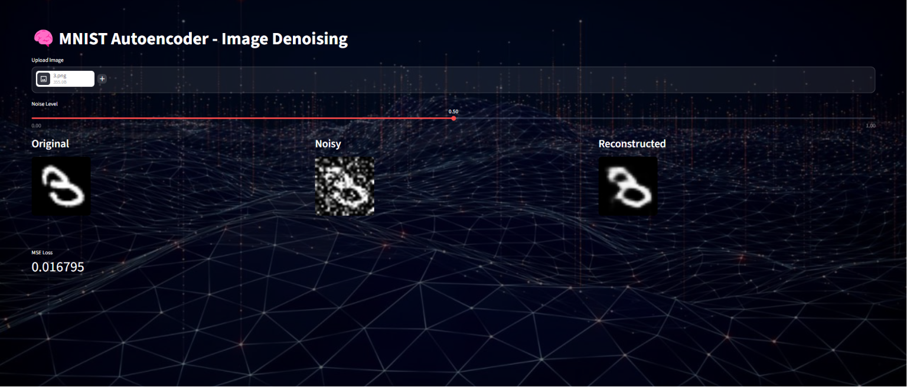

# Denoising Autoencoder - MNIST Image Restoration

An AI-powered image denoising system built with **PyTorch and Streamlit**.  
The model learns how to reconstruct clean handwritten digits from noisy inputs using a convolutional autoencoder.

---

## Features

- Convolutional Autoencoder for image reconstruction  
-  Add controllable noise to input images  
-  Upload custom handwritten digit images  
-  Adjustable noise level slider  
-  Real-time image comparison (Original / Noisy / Reconstructed)  
-  MSE loss visualization  
-  Custom Streamlit UI with background image  
-  Fast inference using trained PyTorch model  

---

## 🛠️ Tech Stack

- Python 3  
- PyTorch  
- TorchVision  
- NumPy  
- Matplotlib  
- Streamlit  
- Pillow (PIL)  

---

##  Project Structure

```bash
Denoising_Autoencoder/
│
├── app.py                  # Streamlit application
├── autoencoder.pth        # Trained model weights
├── denoising_autoencoder.ipynb  # Training notebook
├── photo.jpg              # Background image for UI
│
├── data/                  # MNIST dataset (auto downloaded)
│
└── README.md
```

---
##  Model Architecture

- The model is a simple Convolutional Autoencoder:

Encoder:
- Conv2D → ReLU
- Conv2D → ReLU
Decoder:
- ConvTranspose2D → ReLU
- ConvTranspose2D → Sigmoid

It learns to map noisy images → clean images.

##  UI Preview

- 
  ---

## How to Run
1. Create virtual environment
```
python -m venv ml
```
2. Activate environment
```
ml\Scripts\activate
```
3. Install dependencies
```
pip install torch torchvision numpy matplotlib streamlit pillow
```
4. Run the app
```
streamlit run app.py
```
## How It Works
1. Upload a handwritten digit image
2. Add noise using slider
3. Model reconstructs clean image
4. Compare Original vs Noisy vs Output
5. MSE loss is computed automatically
---

## Future Improvements
1. Add deeper CNN autoencoder
2. Improve reconstruction quality
3. Add SSIM / PSNR metrics
4. Deploy on Streamlit Cloud
5. Support drawing canvas input
---
## Author
A'laa Omar

Heba Shams

Amira Emad

Maryam El said 

Maryam Ashraf⁩ 

Rahma Mohammed 
